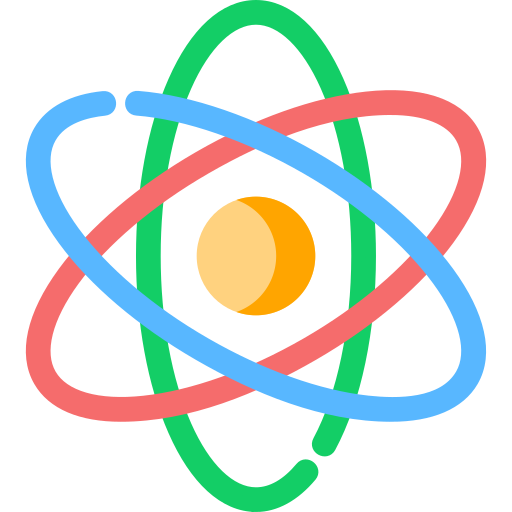

#  whiteshds.ml  
[部落格](https://whiteshds.ml) built with [React](https://reactjs.org/) and hosted with [Netlify](https://www.netlify.com/).

##  Icons

| Use        |                      Icon                      | Short-Code        |
| ---------- | :--------------------------------------------: | ----------------- |
| Dark Mode  |  | `fas moon`        |
| Light Mode |  | `fas sun`         |
| GitHub     |  | `fab github`      |
| LinkedIn   |  | `fab linkedin`    |
| Resume     |  | `fas file-alt`    |
| Email      |  | `fas paper-plane` |

##  颜色参考

文字和图标在网站背景下的色彩对比度为4.5：1，符合WCAG 2.1第1.4.3节的规定。

| Name   |                          Color                           | Hex       |
| ------ | :------------------------------------------------------: | --------- |
| Black  |  | `#000000` |
| Purple |  | `#C311E7` |
| Blue   |  | `#00BFFF` |
| Green  |  | `#90EE90` |
| Gold   |  | `#E6BF00` |
| Red    |  | `#FF6347` |
| Silver |  | `#BBBBBB` |
| Smoke  |  | `#EEEEEE` |

---
如果您发现此项目有用，请考虑给它一个！如果您有任何问题或反馈，请提出一个问题，我会尽快与您联系。
